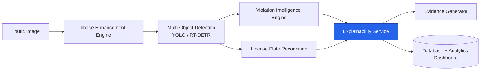
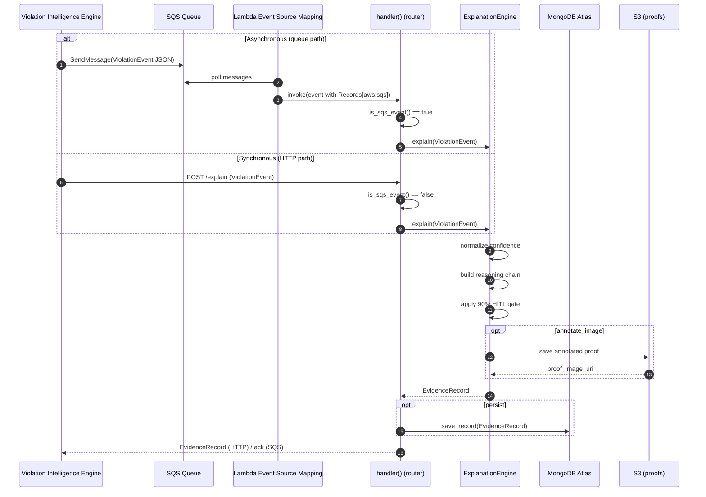
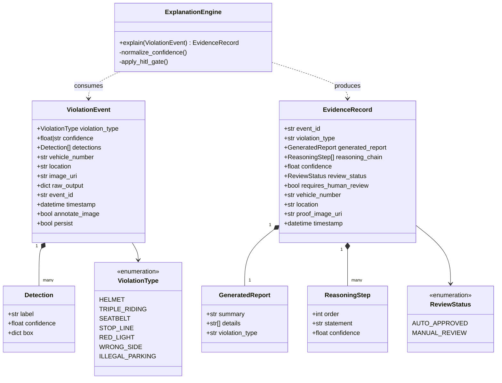
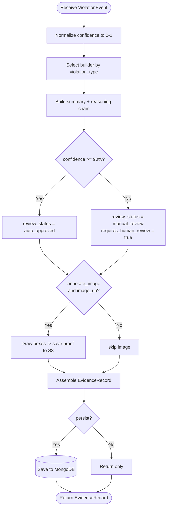
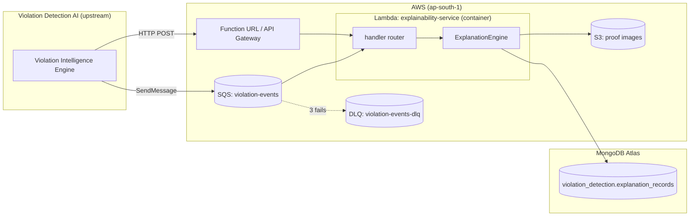
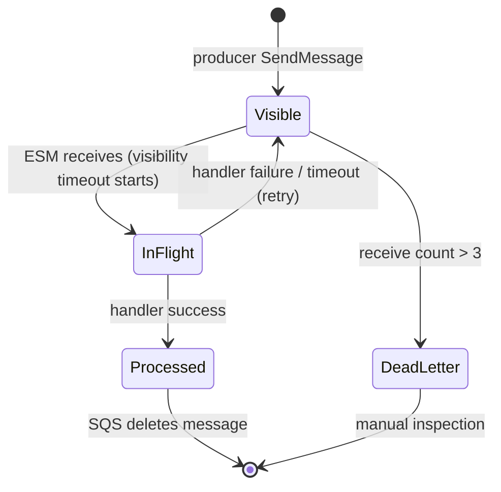

# Explainability Service — UML Diagrams

UML for the **Explainability Service** within the *Violation Detection AI*
platform. Diagrams use [Mermaid](https://mermaid.js.org/) and render on GitHub,
in VS Code (Mermaid extension), or at [mermaid.live](https://mermaid.live).

- [1. Context — Violation Detection AI platform](#1-context-diagram)
- [2. Sequence — HTTP and SQS paths](#2-sequence-diagram)
- [3. Class — data model and engine](#3-class-diagram)
- [4. Activity — processing logic](#4-activity-diagram)
- [5. Component / Deployment — where it runs](#5-component--deployment-diagram)
- [6. State — SQS message lifecycle](#6-state-diagram-sqs-message-lifecycle)

---

## 1. Context Diagram

Where this service sits in the wider platform.

---

## 2. Sequence Diagram

The two paths through the service: asynchronous (SQS) and synchronous (HTTP).

---

## 3. Class Diagram

Mirrors `app/schemas.py` and `app/engine.py`.

---

## 4. Activity Diagram

The processing logic, including the human-in-the-loop gate.

---

## 5. Component / Deployment Diagram

Where the pieces run.

---

## 6. State Diagram (SQS message lifecycle)

How a queued message moves through SQS until it is processed or dead-lettered.

